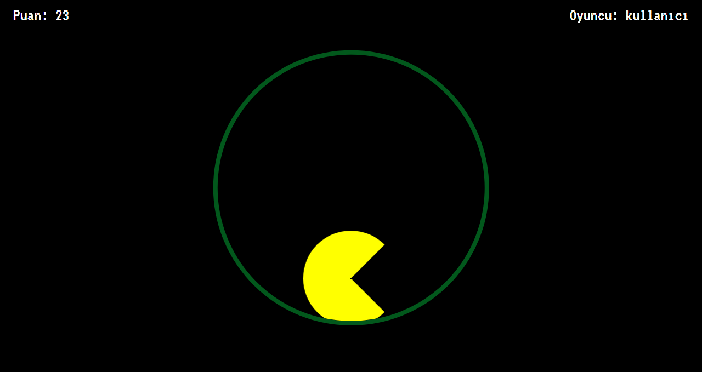

# Pure-CSS-And-JavaScirpt-Click-Game
A simple and fun game that increases or decreases the score as I click on the characters I create with CSS.
#
- HTML page
- Simple code
- Game
- Basic funny game
- simple to use
- Pure CSS and JavaScript
#

# Instagram Account Link

